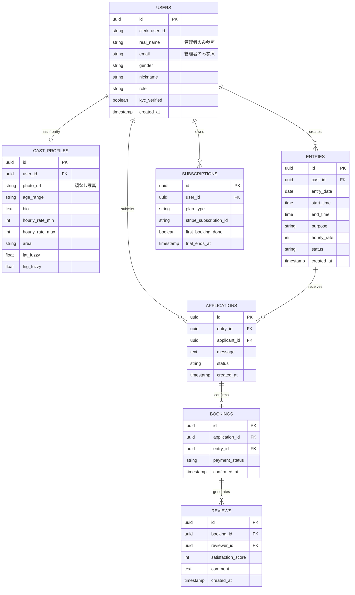

# お相手レンタルシステム — DB設計・API設計書

## 1. システム全体構成

```
Next.js フロントエンド（Googleマップ UI / 検索画面）
        │
        ▼
API層（Next.js API Routes：認証・マッチング・決済処理）
        │
        ├── Clerk（認証・本人確認）
        ├── Google Maps API（ファジー表示）
        ├── Stripe（サブスク・決済管理）
        ▼
Supabase（PostgreSQL / PostGIS / Realtime）
        │
        ▼
Render（ホスティング）
```

技術スタックは前回構想案（Render / Supabase / Clerk / Stripe / Google Maps）のまま採用。

---

## 2. データベース設計（ER図）



### 2.1 テーブル設計の要点

**USERS（全ユーザー共通）**
`real_name`・`email`・`gender`はRLS（Row Level Security）で管理者ロールのみ参照可能に制限する。他ユーザーから見えるのは`nickname`と`role`（`user` / `cast` / `both`）のみ。出会い系サイト規制法上求められる「本人確認情報の管理者による把握」と「利用者へのニックネーム表示」を両立する設計。

**CAST_PROFILES（キャストの公開プロフィール）**
`lat_fuzzy`・`lng_fuzzy`は実際の座標に半径数百m〜1km程度のランダムオフセットを加えた値を保存する。正確な位置情報はUSERS側か別の非公開テーブルで管理し、マッチング確定後に当日の集合場所をメッセージ内で個別にやり取りする。

**ENTRIES（エントリー情報）**
`status`は以下のステートマシンで管理する。

| ステータス | 意味 |
|---|---|
| open | 募集中 |
| matched | マッチング成立 |
| completed | 完了 |
| cancelled | キャンセル |

**APPLICATIONS（申込）**
複数人が同じエントリーに申込めるため、`status`は `pending` → `confirmed` / `rejected` で管理する。

**SUBSCRIPTIONS（サブスク管理）**
`first_booking_done`フラグが「初回マッチング成立まで無料」ロジックの核となる。`BOOKINGS`が確定した時点でこのフラグをtrueにし、以降のエントリー作成時にサブスク課金チェックを行う。

**決済について**
レンタル料は当日現地払いのため、Stripeはサブスク課金のみに使用し、レンタル料自体の決済APIは不要。（将来的にエスクロー化を検討する場合は別途設計が必要）

---

## 3. マッチング成立までのAPIフロー

```
POST /api/entries
  └─ キャストがエントリー作成
        │
        ▼
GET /api/entries/map
  └─ ファジー座標一覧をマップ表示
        │
        ▼
GET /api/entries/:id
  └─ 詳細プロフィール取得
        │
        ▼
POST /api/applications
  └─ ユーザーが申込・メッセージ送信
        │
        ▼
PATCH /api/applications/:id/confirm
  └─ キャストが確定者に返信→成立
        │
        ▼
POST /api/bookings/:id/complete
  └─ 当日終了後に完了マーク
        │
        ▼
POST /api/reviews
  └─ 相互レビュー投稿
```

### 3.1 主要エンドポイント仕様

**POST /api/entries**（キャストのエントリー作成）
リクエストボディ：`entry_date`, `start_time`, `end_time`, `purpose`, `hourly_rate`。サーバー側で`lat_fuzzy`/`lng_fuzzy`をプロフィールから複製する。`SUBSCRIPTIONS.first_booking_done`が`false`なら無料、`true`なら有効なサブスクがあるかを確認するゲートを入れる。

**GET /api/entries/map**
性別・日付・目的・エリアでフィルタ可能なクエリパラメータを受け、ファジー座標のみを返す。本名・メールは絶対に含めない。

**POST /api/applications**
`entry_id`と`message`を受け取り、Supabase RealtimeでキャストにWebSocket通知を送る。

**PATCH /api/applications/:id/confirm**
キャストのみが実行可能。確定した`application`以外の同エントリーへの申込は自動的に`rejected`にし、`BOOKINGS`レコードを生成する。

---

## 4. 今後の着手順序（推奨）

1. Supabaseのテーブル作成SQL（RLSポリシー含む）を固める
2. Clerkとの連携（`clerk_user_id`の紐付け）
3. エントリー作成・マップ表示のAPI実装
4. 申込・マッチングAPIの実装

依存関係上、この順序が自然である。

---

*作成日：2026年6月*
*バージョン：v1（DB設計・API設計レベル）*
